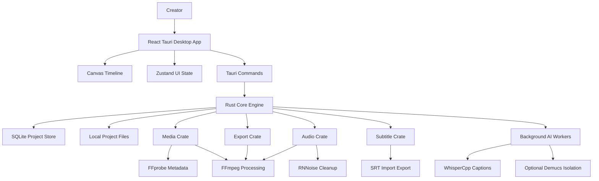

# OpenFrame MVP Architecture

OpenFrame should start as a lightweight local desktop editor. The frontend owns interaction and timeline presentation, while Rust owns filesystem access, job coordination, and FFmpeg orchestration.



## Layers

### React and Tauri UI

Responsibilities:

- Render the media bin, preview panel, timeline controls, inspectors, subtitles, and export UI.
- Manage transient UI state with Zustand.
- Draw the MVP timeline with Canvas.
- Send long-running work to Tauri commands instead of blocking the UI thread.

### Rust Core Engine

Responsibilities:

- Coordinate project files and local SQLite state.
- Own job lifecycle for metadata extraction, thumbnails, waveforms, captions, audio cleanup, and exports.
- Spawn FFmpeg/FFprobe processes and report progress back to the UI.
- Keep media processing off the frontend thread.

### Media Pipeline

Responsibilities:

- Use FFprobe for metadata extraction.
- Use FFmpeg for thumbnails, waveforms, proxies, transcodes, audio filters, subtitle burn-in, and final MP4 export.
- Avoid custom decoders and encoders in the MVP.

### AI Worker Layer

Responsibilities:

- Run Whisper.cpp caption jobs locally with tiny.en or base.en.
- Run RNNoise cleanup locally when integrated.
- Keep Demucs voice isolation optional; the editor must continue to work when it is unavailable.

## Initial Workspace Layout

The planned Phase 1 layout remains:

```text
apps/desktop
crates/core
crates/media
crates/audio
crates/subtitles
crates/export
crates/ai
assets
test-media
docs
```

## Key Architecture Rules

- Do not build a GPU renderer for the MVP.
- Do not build custom media encoders.
- Do not depend on paid cloud APIs.
- Do not run AI jobs on the UI thread.
- Prefer measured performance work over speculative optimization.
